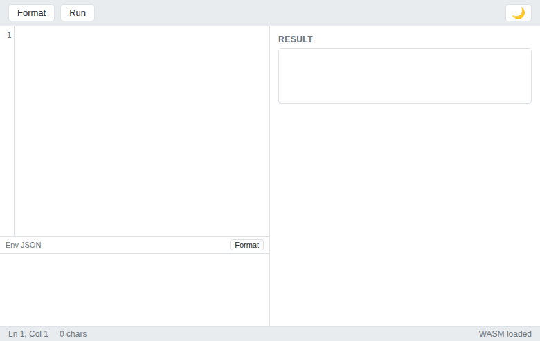
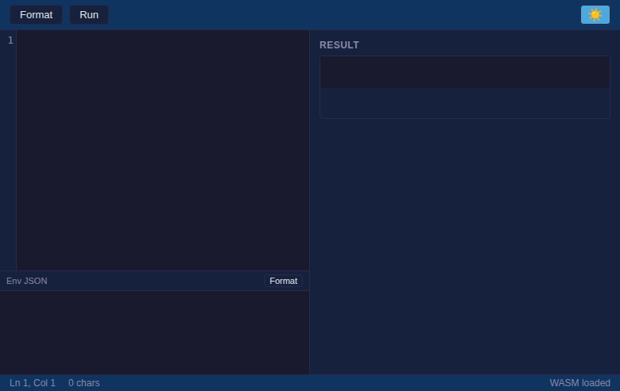

# Better Expr Editor

A browser-based editor for the [Expr](https://github.com/expr-lang/expr) expression language with live evaluation, syntax formatting, and AST inspection — all running client-side via Go WASM.

## Quick Start

```bash
npx better-expr-editor
```

Or download the [latest binary](https://github.com/diogenesc/better-expr-editor/releases):

```bash
./expr-editor
```

Or use Docker:

```bash
docker run -p 8080:8080 ghcr.io/diogenesc/better-expr-editor
```

Open `http://localhost:8080`.

## Screenshots

**Light mode**



**Dark mode**



## Features

- CodeMirror 6 editor with Expr syntax highlighting, bracket matching, undo/redo
- Live expression evaluation against a JSON environment
- Auto-formatting with pipe-aware layout and multi-line splitting
- JSON environment editor with format-on-click
- AST and bytecode inspection
- Dark/light theme with persistent toggle
- Everything saved to localStorage
- Entirely client-side — no server round-trips

## Development

```bash
npm install
mise run wasm
npm run dev
```

Open `http://localhost:5173`.

```bash
go test ./formatter/   # Run formatter tests
```

## How it works

```
┌─────────────────────────────────────┐
│  Browser                             │
│  ┌──────────┐  ┌──────────────────┐ │
│  │ CodeMirror│  │  Go WASM         │ │
│  │ 6 Editor  │──│  exprFormat()    │ │
│  │ (Expr +   │  │  exprRun()       │ │
│  │  JSON)    │  │  exprCompile()   │ │
│  └──────────┘  │  exprDisassemble()│ │
│       │        └──────────────────┘ │
│       ▼                ▲            │
│  ┌────────┐      ┌─────────┐       │
│  │ Result │      │ Env JSON│       │
│  │ Pane   │      │ Editor  │       │
│  └────────┘      └─────────┘       │
└─────────────────────────────────────┘
```

The Go WASM module compiles and evaluates Expr expressions, formats them, and disassembles bytecode — all inside your browser.

## Tech Stack

- **Frontend:** TypeScript, CodeMirror 6, Vite
- **WASM:** Go (expr-lang/expr)
- **Packaging:** npm, Docker, Go binary
